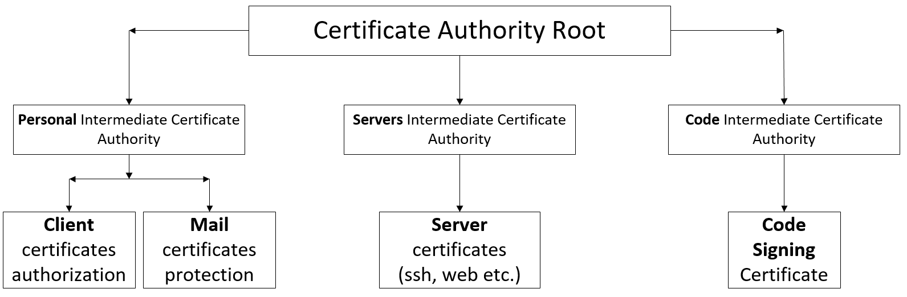

Доброго времени, Хабраюзер!

Хочу поделиться с тобой идеей беспарольной аутентификации. Недавно лазил по сайтам центров сертификаций и наткнулся на интересную вещь. ЦС использую аутентификацию по сертификату вместо пароля. Я считаю это удобным, для компании, а не для обычных интернет сайтов, где шарятся простые пользователи, но вход в АД (админ-центр сайта), было бы неплохо.
<a id="habracut"></a>
Я предлагаю вот такую структуру сертификации внутри компании.



Условно назовем компанию CertService c доменным именем СertService.info Еще знаем, что есть разные отделы, но мы не будем их трогать. Сейчас разберемся со структурой директорий и будем говорить о конфигурации openssl.

### Структура директорий на сервере CA

Наша основная директория /root/ca. А вот у нее внутри уже видим следующее:

- RootCA – *директория корневого сертификата*
- Config – *конфигурации для OpenSSL*
- PersonIntermediateCA – *промежуточный сертификат для пользовательских сертификатов*
- ServerIntermediateCA – *промежуточный сертификат для серверных сертификатов*
- CodeIntermediateCA – *промежуточный сертификат для сертификатов подписи кода*
- Внутри этих директорий есть свои, посмотри и на них: *(/root/ca/{RootCA, PersonIntermediateCA, ServerIntermediateCA, CodeIntermediateCA})*
- certs – *директория для сертификатов*
- crl – *директория для отозванных сертификатов*
- csr – *эта директория только для промежуточных сертификатов (запросы на создание сертификата)*
- private (chmod 400) – *директория для приватных ключей*
- index.txt – *файл текстовой базы сертификатов*
- serial – *серийный номер следующего сертификата*
- crlnumber – *серийный номер для следующего отзыва сертификата*
- Немного разобрались с директориями и файлами, которые нам нужны. Теперь перейдем к написанию частей конфигурации OpenSSL для нашего ЦС

### Секции конфигурации для OpenSSL

#### \[ ca \]

Раздел \[ca\] является обязательным. Заморачиваться с ним не будем и скажем ему, что хотим свою секцию по умолчанию.

```
[ ca ] 
default_ca = CA_default 
```

#### \[ CA_default \]

В секции \[CA_default\] зададим значения по умолчанию. Сначала пропишем пути основных директорий

```
[ CA_default ]
# Переменные указывающие директории, нам это пригодиться в конфиге
# (чтоб не редактировать в ста местах)
dir = /root/ca/RootCA
certs = $dir/certs
new_certs_dir = $certs
private = $dir/certs
crl_dir = $dir/crl
serial = $dir/serial 
database = $dir/index.txt
RANDFILE = $dir/private/.rand 
```

- dir – это исключительно наша переменная, для того, чтоб сэкономить нам время. Тут мы укажем пусть до основной директории того ЦС, для которого конфигурация будет предназначена;
- certs – эта переменная для сертификатов, ей мы указываем нашу папку;
- new\_certs\_dir – аналогично certs (в разных версиях OpenSSL разные переменные для сертификатов), поэтому указываем обе;
- private – в эту переменную передаем место нашей приватной директории, в описании директорий, мы уже говорили, что тут храним приватные ключи;
- crl_dir – как уже говорили, тут будет путь к директории отозванных сертификатов;
- serial – указываем наш файл serial;
- database – текстовая база данных, наш index.txt;
- RANDFILE – случайный файл для случайных данных.

Идем дальше и укажем теперь определенные параметры

```
# Сертификат и ключ, которым будет подписан другой сертификат,
# проходящий через этот конфиг (в данном случае - это корневой сертификат)
private_key = $private/RootCA.key.pem
certificate = $certs/RootCA.cert.pem

# Параметры для отозванных сертификатов
crlnumber = $dir/crlnumber
crl = $crl_dir/RootCA.crl.pem
crl_extensions = crl_ext
default_crl_days = 30

# используемый алгоритм хеширования
default_md = sha256

name_opt = ca_default
cert_opt = ca_default

default_days = 365
preserve = no
policy = policy_root 
```

- private_key и certificate – указываем путь и имена файлов приватного ключа и сертификата, соответственно. Эти параметры используются, когда мы подписываем сертификат. В данный момент, указан корневой сертификат (мы им будем подписывать промежуточные);
- crlnumber – как говорилось, путь к файлу с серийным номером для отзыва;
- crl – файл отозванных сертификатов (не уверен в правильности утверждения);
- crl_extensions – расширение, которые вызывается при crl;
- default\_crl\_days – количество дней до нового CRL;
- default_md – алгоритм хеширования;
- name\_opt и cert\_opt – отвечают за вывод и формат вывода информации по проверяемому сертификату;
- default_days – сколько дней будет сертификат действителен;
- preserve – заставляем конечный сертификат совпадать порядком полей с корневым (или промежуточным);
- policy – политика для подписи сертификата;

> **policy**
> policy — в разных конфигурациях мы укажем разные значения. У нас их будет несколько: policy\_root, policy\_intermediate\_person, policy\_intermediate\_server, policy\_intermediate_code.
> policy_root — будет в конфигурации для корневого сертификата, и у него будет заданы жесткие правила для подписи промежуточных.
> policy_intermediate — а эта секция правил будет в конфигурации промежуточных, и правила подписи будут не такими строгими.
> 
> Параметры:
> 
> - match — Обязательное заполнение, полное совпадение с Root CA
> - supplied — Обязательное заполнение, не обязательно совпадение с Root CA
> - optional — Не обязательное поле для заполнения

Напишем политики, о которых мы сказали в примечании

```
[ policy_root ]
countryName = match
stateOrProvinceName = match
organizationName = match
organizationalUnitName = supplied
commonName = supplied
emailAddress = optional
subjectAltName = optional

[ policy_intermediate_person ]
countryName = optional
stateOrProvinceName = optional
localityName = optional
organizationName = match
organizationalUnitName = optional
commonName = supplied
emailAddress = supplied
subjectAltName = optional

[ policy_intermediate_code ]
countryName = optional
stateOrProvinceName = optional
localityName = optional
organizationName = match
organizationalUnitName = optional
commonName = supplied
emailAddress = optional
subjectAltName = optional

[ policy_intermediate_server ]
countryName = optional
stateOrProvinceName = optional
localityName = optional
organizationName = match
organizationalUnitName = optional
commonName = supplied
emailAddress = supplied
subjectAltName = supplied 
```

Тут мы не будем останавливаться, т.к. уже все расписано ранее. А о полях я расскажу чуть-чуть позже.

#### \[ req \]

Параметры из раздела \[req\] применяются при создании сертификатов или запросов на подпись сертификата.

```
[ req ]
default_bits = 2048
distinguished_name = req_distinguished_name
string_mask = utf8only
default_md = sha256

# Расширение при использовании опции -x509.
x509_extensions = root_ca 
```

Что можно сказать тут:

- default_bits – размер ключа RSA по умолчанию;
- distinguished_name – этот параметр вызовет секцию, в которой перечислены параметры для сертификата;
- string_mask – в какой кодировке будет наш текст в сертификате;
- default_md – все тот же алгоритм хеширования;
- x509_extensions – тут указана секция, которая будет использована, когда будет указа параметр x509;

#### \[ req\_distinguished\_name \]

Как мы уже сказали, тут перечислим поля, которые нам нужны для сертификата.

```
[ req_distinguished_name ]
countryName = Country Name (2 letter code) (C)
countryName_min = 2
countryName_max = 2
countryName_default = RU

stateOrProvinceName = State or Province Name (S)
stateOrProvinceName_default = Krasnoyarskiy kray

localityName = Locality Name (L)
localityName_default = Norilsk

0.organizationName = Organization Name (O)
0.organizationName_default = CertService

organizationalUnitName = Organizational Unit Name (OU) organizationalUnitName_default = CertService. IT-Department.

commonName = Common Name (CN)
#commonName_default = CertService.info

emailAddress = Email Address
emailAddress_max = 60
#emailAddress_default = support@CertService.info

subjectAltName = Alternative DNS names (comma seperated list)
#subjectAltName_default = DNS:www.CertService.info 
```

- countryName – страна, код страны A2 (ISO) [www.worldatlas.com/aatlas/ctycodes.htm](http://www.worldatlas.com/aatlas/ctycodes.htm) ;
- localityName – Город;
- 0.organizationName – название организации;
- organizationalUnitName – отдел\\департамент организации;
- commonName – Для серверов это доменное имя, ип адрес. для ПО – название приложения, для пользователя – ФИО. Для корневого и промежуточного их название;
- emailAddress – почта;
- subjectAltName – альтернативное название (другие домены, почты и т.д.);
- _default – задает значение по умолчанию;

С этим все, теперь идем дальше.

### Расширения

Следующие несколько секций — это расширения, которые могут использоваться при создании сертификатов. К примеру, при передаче аргумента командой -extensions root\_ca будет применяться секция \[ root\_ca \].

#### Для корневого сертификата

Для корневого сертификата у нас секция будет называться root_ca.

```
[ root_ca ]
subjectKeyIdentifier = hash
authorityKeyIdentifier = keyid:always,issuer
basicConstraints = critical, CA:true
keyUsage = critical, digitalSignature, cRLSign, keyCertSign 
```

- subjectKeyIdentifier – идентификатор субъекта. Может быть шестнадцатеричной строкой (hex), либо хешем (hash);
- authorityKeyIdentifier – этот параметр допускает всего два значения keyid и issuer. Keyid – копирует идентификатор ключевого слова из родительского, если не получается получить и стоит always, то вернется ошибка. Issuer копирует issuer(подписанта) и серийный номер из сертификата, которым подписан. Он работает, только в том случае, если не работает keyid;
- basicConstraints – CA – если true, то разрешает быть issuer’ом, false – нет (для уточнения: issuer – эмитет (подписант), т.е. может подписывать сертификаты);
- keyUsage – что может делать сертификат;

> Значение ключа keyUsage|Описание
> — — serverAuth Аутентификация веб-сервера SSL / TLS.
> clientAuth Аутентификация веб-клиента SSL / TLS.
> codeSigning Подписание кода.
> emailProtection Защита электронной почты (S / MIME).
> timeStamping Доверенная отметка времени.
> msCodeInd Microsoft Индивидуальная подмена кода (аутентификация).
> msCodeCom Microsoft Подписание коммерческого кода (аутентификация).
> msCTLSign Microsoft Доверенный лист подписей.
> msSGC Microsoft Сервер криптографической защиты.
> msEFS Microsoft Шифрование файловой системы.
> nsSGC Netscape Server Gated Crypto.

#### Для промежуточных сертификатов

```
[ intermediate_ca ]
subjectKeyIdentifier = hash
authorityKeyIdentifier = keyid:always,issuer
basicConstraints = critical, CA:true, pathlen:0
keyUsage = critical, digitalSignature, cRLSign, keyCertSign 
```

> **Важное замечание:**
> Параметр basicConstraints содержит «pathlen:0». pathlen указывает максимальное количество ЦС, которые могут появляться ниже этого в цепочке. Поэтому, если у вас есть ЦС с нулевой точкой, он может использоваться только для подписывания сертификатов конечных пользователей, а не для дальнейших ЦС.
> 
> То есть, если вы хотите создать промежуточные сертификаты отделам, а потом пользователям, то pathlen должен будет быть равен 1, и также рекомендую создать расширение для таких сертификатов с параметром равным нулю.

#### Для конечных сертификатов

Клиентские (для аутентификации и почты)

```
[ user_cert ]
# Пользовательский (для аутентификации и почты
 basicConstraints = CA:FALSE
nsCertType = client, email
nsComment = "Client certificates"
subjectKeyIdentifier = hash
authorityKeyIdentifier = keyid,issuer
keyUsage = critical, nonRepudiation, digitalSignature, keyEncipherment extendedKeyUsage = clientAuth, emailProtection 
```

- nsCertType – тип сертификата. Допустимые значения: client, server, email, objsign, reserved, sslCA, emailCA, objCA;
- nsComment – комментарий к сертификату;

Серверные

```
[ server_cert ]
# Серверный
basicConstraints = CA:FALSE
nsCertType = server
nsComment = "Server Certificate"
subjectKeyIdentifier = hash
authorityKeyIdentifier = keyid,issuer:always
keyUsage = critical, digitalSignature, keyEncipherment
extendedKeyUsage = serverAuth 
```

Для подписи кода

```
[ code_cert ]
# Для подписи кода
basicConstraints = CA:FALSE
nsCertType = server
nsComment = "Code Certificate"
subjectKeyIdentifier = hash
authorityKeyIdentifier = keyid,issuer:always
keyUsage = digitalSignature
extendedKeyUsage = codeSigning, msCodeInd, msCodeCom 
```

Остальное (об этом позже)

```
[ crl_ext ]
# Для отзыва сертификатов
authorityKeyIdentifier=keyid:always

[ ocsp ]
# Для OCSP (Online Certificate Status Protocol)
basicConstraints = CA:FALSE
subjectKeyIdentifier = hash
authorityKeyIdentifier = keyid,issuer
keyUsage = critical, digitalSignature
extendedKeyUsage = critical, OCSPSigning 
```

### Уходим в консоль

Базовую конфигурацию мы подготовили, теперь можно и в консоль идти :)

Создаем рабочие директории

```
mkdir -p /root/ca/config
mkdir -p /root/ca/{RootCA,PersonIntermediateCA,ServerIntermediateCA,CodeIntermediateCA}/{certs,crl,newcerts,private}
mkdir -p /root/ca/{PersonIntermediateCA,ServerIntermediateCA,CodeIntermediateCA}/csr 
```

Выставим всем private права 400

```
chmod 400 /root/ca/RootCA/private
chmod 400 /root/ca/PersonIntermediateCA/private
chmod 400 /root/ca/ServerIntermediateCA/private
chmod 400 /root/ca/CodeIntermediateCA/private 
```

Создаем файлы конфигурации

```
touch /root/ca/config/RootCA.cnf
touch /root/ca/config/PersonIntermediateCA.cnf cp
touch /root/ca/config/ServerIntermediateCA.cnf cp 
touch /root/ca/config/CodeIntermediateCA.cnf 
```

**RootCA.cnf**

```
[ ca ]
default_ca = CA_default

[ CA_default ]
# Переменные указывающие директории, нам это пригодиться в конфиге 
# (чтоб не редактировать в ста местах)
dir               = /root/ca/RootCA
certs             = $dir/certs
private           = $dir/private
crl_dir           = $dir/crl
new_certs_dir     = $dir/newcerts
database          = $dir/index.txt
serial            = $dir/serial
RANDFILE          = $dir/private/.rand

# Сертификат и ключ, которым будет подписан другой сертификат, 
# проходящий через этот конфиг (в данном случае - это корневой сертификат)
private_key       = $private/RootCA.key.pem
certificate       = $certs/RootCA.cert.pem

# Параметры для отозванных сертификатов
crlnumber         = $dir/crlnumber
crl               = $crl_dir/RootCA.crl.pem
crl_extensions    = crl_ext
default_crl_days  = 30

# используемый алгоритм хеширования
default_md        = sha256

name_opt          = ca_default
cert_opt          = ca_default
default_days      = 365
preserve          = no
policy            = policy_root

[ policy_root ]
countryName = match
stateOrProvinceName = match
organizationName = match
organizationalUnitName = supplied
commonName = supplied
emailAddress = optional
subjectAltName = optional

[ req ]
default_bits        = 2048
distinguished_name  = req_distinguished_name
string_mask         = utf8only

default_md          = sha256

# Расширение при использовании опции -x509.
x509_extensions     = root_ca

[ req_distinguished_name ]
countryName                     = Country Name (2 letter code) (C)
countryName_min		= 2
countryName_max		= 2
countryName_default          = RU

stateOrProvinceName             = State or Province Name (S)
stateOrProvinceName_default     = Krasnoyarskiy kray

localityName                    = Locality Name (L)
localityName_default            = Norilsk

0.organizationName              = Organization Name (O)
0.organizationName_default      = CertService

organizationalUnitName          = Organizational Unit Name (OU)
organizationalUnitName_default = CertService. IT-Department.

commonName                      = Common Name (CN)
#commonName_default          = CertService.info

emailAddress                    = Email Address
emailAddress_max		= 60
#emailAddress_default          = support@CertService.info

subjectAltName = Alternative DNS names (comma seperated list)
#subjectAltName_default = DNS:www.CertService.info

[ root_ca ]
subjectKeyIdentifier = hash
authorityKeyIdentifier = keyid:always,issuer
basicConstraints = critical, CA:true
keyUsage = critical, digitalSignature, cRLSign, keyCertSign

[ intermediate_ca ]
subjectKeyIdentifier = hash
authorityKeyIdentifier = keyid:always,issuer
basicConstraints = critical, CA:true, pathlen:0
keyUsage = critical, digitalSignature, cRLSign, keyCertSign

[ crl_ext ]
# Для отзыва сертификатов
authorityKeyIdentifier=keyid:always

[ ocsp ]
# Для OCSP (Online Certificate Status Protocol)
basicConstraints = CA:FALSE
subjectKeyIdentifier = hash
authorityKeyIdentifier = keyid,issuer
keyUsage = critical, digitalSignature
extendedKeyUsage = critical, OCSPSigning
```

**PersonIntermediateCA.cnf**

```
[ ca ]
default_ca = CA_default

[ CA_default ]
# Переменные указывающие директории, нам это пригодиться в конфиге 
# (чтоб не редактировать в ста местах)
dir               = /root/ca/PersonIntermediateCA
certs             = $dir/certs
private           = $dir/private
crl_dir           = $dir/crl
new_certs_dir     = $dir/newcerts
database          = $dir/index.txt
serial            = $dir/serial
RANDFILE          = $dir/private/.rand

# Сертификат и ключ, которым будет подписан другой сертификат, 
# проходящий через этот конфиг (в данном случае - это корневой сертификат)
private_key       = $private/PersonIntermediateCA.key.pem
certificate       = $certs/PersonIntermediateCA.cert.pem

# Параметры для отозванных сертификатов
crlnumber         = $dir/crlnumber
crl               = $crl_dir/PersonIntermediateCA.crl.pem
crl_extensions    = crl_ext
default_crl_days  = 30

# используемый алгоритм хеширования
default_md        = sha256

name_opt          = ca_default
cert_opt          = ca_default
default_days      = 365
preserve          = no
policy            = policy_intermediate_person

[ policy_intermediate_person ]
countryName = optional
stateOrProvinceName = optional
localityName = optional
organizationName = match
organizationalUnitName = optional
commonName = supplied
emailAddress = supplied
subjectAltName = optional

[ req ]
default_bits        = 2048
distinguished_name  = req_distinguished_name
string_mask         = utf8only

default_md          = sha256

# Расширение при использовании опции -x509.
x509_extensions     = root_ca

[ req_distinguished_name ]
countryName                     = Country Name (2 letter code) (C)
countryName_min		= 2
countryName_max		= 2
countryName_default          = RU

stateOrProvinceName             = State or Province Name (S)
stateOrProvinceName_default     = Krasnoyarskiy kray

localityName                    = Locality Name (L)
localityName_default            = Norilsk

0.organizationName              = Organization Name (O)
0.organizationName_default      = CertService

organizationalUnitName          = Organizational Unit Name (OU)
organizationalUnitName_default = CertService. IT-Department.

commonName                      = Common Name (CN)
#commonName_default          = CertService.info

emailAddress                    = Email Address
emailAddress_max		= 60
#emailAddress_default          = support@CertService.info

subjectAltName = Alternative DNS names (comma seperated list)
#subjectAltName_default = DNS:www.CertService.info

[ root_ca ]
subjectKeyIdentifier = hash
authorityKeyIdentifier = keyid:always,issuer
basicConstraints = critical, CA:true
keyUsage = critical, digitalSignature, cRLSign, keyCertSign

[ intermediate_ca ]
subjectKeyIdentifier = hash
authorityKeyIdentifier = keyid:always,issuer
basicConstraints = critical, CA:true, pathlen:0
keyUsage = critical, digitalSignature, cRLSign, keyCertSign

[ user_cert ]
basicConstraints = CA:FALSE
nsCertType = client, email
nsComment = "Client certificates"
subjectKeyIdentifier = hash
authorityKeyIdentifier = keyid,issuer
keyUsage = critical, nonRepudiation, digitalSignature, keyEncipherment 
extendedKeyUsage = clientAuth, emailProtection

[ crl_ext ]
# Для отзыва сертификатов
authorityKeyIdentifier=keyid:always

[ ocsp ]
# Для OCSP (Online Certificate Status Protocol)
basicConstraints = CA:FALSE
subjectKeyIdentifier = hash
authorityKeyIdentifier = keyid,issuer
keyUsage = critical, digitalSignature
extendedKeyUsage = critical, OCSPSigning
```

**ServerIntermediateCA.cnf**

```
[ ca ]
default_ca = CA_default

[ CA_default ]
# Переменные указывающие директории, нам это пригодиться в конфиге 
# (чтоб не редактировать в ста местах)
dir               = /root/ca/ServerIntermediateCA
certs             = $dir/certs
private           = $dir/private
crl_dir           = $dir/crl
new_certs_dir     = $dir/newcerts
database          = $dir/index.txt
serial            = $dir/serial
RANDFILE          = $dir/private/.rand

# Сертификат и ключ, которым будет подписан другой сертификат, 
# проходящий через этот конфиг (в данном случае - это корневой сертификат)
private_key       = $private/ServerIntermediateCA.key.pem
certificate       = $certs/ServerIntermediateCA.cert.pem

# Параметры для отозванных сертификатов
crlnumber         = $dir/crlnumber
crl               = $crl_dir/ServerIntermediateCA.crl.pem
crl_extensions    = crl_ext
default_crl_days  = 30

# используемый алгоритм хеширования
default_md        = sha256

name_opt          = ca_default
cert_opt          = ca_default
default_days      = 365
preserve          = no
policy            = policy_intermediate_server

[ policy_intermediate_server ]
countryName = optional
stateOrProvinceName = optional
localityName = optional
organizationName = match
organizationalUnitName = optional
commonName = supplied
emailAddress = supplied
subjectAltName = supplied

[ req ]
default_bits        = 2048
distinguished_name  = req_distinguished_name
string_mask         = utf8only

default_md          = sha256

# Расширение при использовании опции -x509.
x509_extensions     = root_ca

[ req_distinguished_name ]
countryName                     = Country Name (2 letter code) (C)
countryName_min		= 2
countryName_max		= 2
countryName_default          = RU

stateOrProvinceName             = State or Province Name (S)
stateOrProvinceName_default     = Krasnoyarskiy kray

localityName                    = Locality Name (L)
localityName_default            = Norilsk

0.organizationName              = Organization Name (O)
0.organizationName_default      = CertService

organizationalUnitName          = Organizational Unit Name (OU)
organizationalUnitName_default = CertService. IT-Department.

commonName                      = Common Name (CN)
#commonName_default          = CertService.info

emailAddress                    = Email Address
emailAddress_max		= 60
#emailAddress_default          = support@CertService.info

subjectAltName = Alternative DNS names (comma seperated list)
#subjectAltName_default = DNS:www.CertService.info

[ root_ca ]
subjectKeyIdentifier = hash
authorityKeyIdentifier = keyid:always,issuer
basicConstraints = critical, CA:true
keyUsage = critical, digitalSignature, cRLSign, keyCertSign

[ intermediate_ca ]
subjectKeyIdentifier = hash
authorityKeyIdentifier = keyid:always,issuer
basicConstraints = critical, CA:true, pathlen:0
keyUsage = critical, digitalSignature, cRLSign, keyCertSign

[ server_cert ]
# Серверный
basicConstraints = CA:FALSE
nsCertType = server
nsComment = "Server Certificate"
subjectKeyIdentifier = hash
authorityKeyIdentifier = keyid,issuer:always
keyUsage = critical, digitalSignature, keyEncipherment
extendedKeyUsage = serverAuth

[ crl_ext ]
# Для отзыва сертификатов
authorityKeyIdentifier=keyid:always

[ ocsp ]
# Для OCSP (Online Certificate Status Protocol)
basicConstraints = CA:FALSE
subjectKeyIdentifier = hash
authorityKeyIdentifier = keyid,issuer
keyUsage = critical, digitalSignature
extendedKeyUsage = critical, OCSPSigning
```

**CodeIntermediateCA.cnf**

```
[ ca ]
default_ca = CA_default

[ CA_default ]
# Переменные указывающие директории, нам это пригодиться в конфиге 
# (чтоб не редактировать в ста местах)
dir               = /root/ca/CodeIntermediateCA
certs             = $dir/certs
private           = $dir/private
crl_dir           = $dir/crl
new_certs_dir     = $dir/newcerts
database          = $dir/index.txt
serial            = $dir/serial
RANDFILE          = $dir/private/.rand

# Сертификат и ключ, которым будет подписан другой сертификат, 
# проходящий через этот конфиг (в данном случае - это корневой сертификат)
private_key       = $private/CodeIntermediateCA.key.pem
certificate       = $certs/CodeIntermediateCA.cert.pem

# Параметры для отозванных сертификатов
crlnumber         = $dir/crlnumber
crl               = $crl_dir/CodeIntermediateCA.crl.pem
crl_extensions    = crl_ext
default_crl_days  = 30

# используемый алгоритм хеширования
default_md        = sha256

name_opt          = ca_default
cert_opt          = ca_default
default_days      = 365
preserve          = no
policy            = policy_intermediate_code

[ policy_intermediate_code ]
countryName = optional
stateOrProvinceName = optional
localityName = optional
organizationName = match
organizationalUnitName = optional
commonName = supplied
emailAddress = optional
subjectAltName = optional

[ req ]
default_bits        = 2048
distinguished_name  = req_distinguished_name
string_mask         = utf8only

default_md          = sha256

# Расширение при использовании опции -x509.
x509_extensions     = root_ca

[ req_distinguished_name ]
countryName                     = Country Name (2 letter code) (C)
countryName_min		= 2
countryName_max		= 2
countryName_default          = RU

stateOrProvinceName             = State or Province Name (S)
stateOrProvinceName_default     = Krasnoyarskiy kray

localityName                    = Locality Name (L)
localityName_default            = Norilsk

0.organizationName              = Organization Name (O)
0.organizationName_default      = CertService

organizationalUnitName          = Organizational Unit Name (OU)
organizationalUnitName_default = CertService. IT-Department.

commonName                      = Common Name (CN)
#commonName_default          = CertService.info

emailAddress                    = Email Address
emailAddress_max		= 60
#emailAddress_default          = support@CertService.info

subjectAltName = Alternative DNS names (comma seperated list)
#subjectAltName_default = DNS:www.CertService.info

[ root_ca ]
subjectKeyIdentifier = hash
authorityKeyIdentifier = keyid:always,issuer
basicConstraints = critical, CA:true
keyUsage = critical, digitalSignature, cRLSign, keyCertSign

[ intermediate_ca ]
subjectKeyIdentifier = hash
authorityKeyIdentifier = keyid:always,issuer
basicConstraints = critical, CA:true, pathlen:0
keyUsage = critical, digitalSignature, cRLSign, keyCertSign

[ code_cert ]
# Для подписи кода
basicConstraints = CA:FALSE
nsCertType = server
nsComment = "Code Certificate"
subjectKeyIdentifier = hash
authorityKeyIdentifier = keyid,issuer:always
keyUsage = digitalSignature
extendedKeyUsage = codeSigning, msCodeInd, msCodeCom

[ crl_ext ]
# Для отзыва сертификатов
authorityKeyIdentifier=keyid:always

[ ocsp ]
# Для OCSP (Online Certificate Status Protocol)
basicConstraints = CA:FALSE
subjectKeyIdentifier = hash
authorityKeyIdentifier = keyid,issuer
keyUsage = critical, digitalSignature
extendedKeyUsage = critical, OCSPSigning
```

[Готовые конфигурации](https://github.com/Key-K/ssl_article/tree/master/config)

Создадим наши недо-базы данных

```
touch /root/ca/RootCA/index.txt
touch /root/ca/PersonIntermediateCA/index.txt
touch /root/ca/ServerIntermediateCA/index.txt
touch /root/ca/CodeIntermediateCA/index.txt

echo 1000 > /root/ca/RootCA/serial
echo 1A00000000000000 > /root/ca/PersonIntermediateCA/serial
echo 1B00000000000000 > /root/ca/ServerIntermediateCA/serial
echo 1C00000000000000 > /root/ca/CodeIntermediateCA/serial

echo 1000 > /root/ca/RootCA/crlnumber
echo 1FA0000000000000 > /root/ca/PersonIntermediateCA/crlnumber
echo 1FB0000000000000 > /root/ca/ServerIntermediateCA/crlnumber
echo 1FC0000000000000 > /root/ca/CodeIntermediateCA/crlnumber 
```

### Работаем с сертификатами

Создаем корневой приватный ключ

```
openssl genrsa -aes256 -out /root/ca/RootCA/private/RootCA.key.pem 4096 chmod 400 /root/ca/RootCA/private/RootCA.key.pem
```

Создаем корневой сертификат

```
openssl req -config /root/ca/config/RootCA.cnf \
-key /root/ca/RootCA/private/RootCA.key.pem \
-new -x509 -days 7300 -sha256 -extensions root_ca \
-out /root/ca/RootCA/certs/RootCA.cert.pem
chmod 444 /root/ca/RootCA/certs/RootCA.cert.pem 
```

Проверяем валидность сертификата

```
openssl x509 -noout -text -in /root/ca/RootCA/certs/RootCA.cert.pem
```

Создаем промежуточные и подписываем их корневым

```
#Создаем приватный ключ 
openssl genrsa -aes256 \
-out /root/ca/PersonIntermediateCA/private/PersonIntermediateCA.key.pem 4096
chmod 400 /root/ca/PersonIntermediateCA/private/PersonIntermediateCA.key.pem
#Создаем запрос
openssl req -config /root/ca/config/PersonIntermediateCA.cnf -new -sha256 \
-key /root/ca/PersonIntermediateCA/private/PersonIntermediateCA.key.pem \
-out /root/ca/PersonIntermediateCA/csr/PersonIntermediateCA.csr.pem #Создаем подписанный сертификат
openssl ca -config /root/ca/config/RootCA.cnf -extensions intermediate_ca \
-days 3650 -notext -md sha256 \
-in /root/ca/PersonIntermediateCA/csr/PersonIntermediateCA.csr.pem \
-out /root/ca/PersonIntermediateCA/certs/PersonIntermediateCA.cert.pem

Using configuration from /root/ca/config/RootCA.cnf
Enter pass phrase for /root/ca/RootCA/private/RootCA.key.pem: secret

Check that the request matches the signature
Signature ok
Certificate Details:
...
Sign the certificate? [y/n]:y
1 out of 1 certificate requests certified, commit? [y/n]y
Write out database with 1 new entries
Data Base Updated

chmod 444 /root/ca/PersonIntermediateCA/certs/PersonIntermediateCA.cert.pem 
```

**Оставшиеся два промежуточных**

```
#Создаем приватный ключ 
openssl genrsa -aes256 \
-out /root/ca/ServerIntermediateCA/private/ServerIntermediateCA.key.pem 4096
chmod 400 /root/ca/ServerIntermediateCA/private/ServerIntermediateCA.key.pem
#Создаем запрос
openssl req -config /root/ca/config/ServerIntermediateCA.cnf -new -sha256 \
-key /root/ca/ServerIntermediateCA/private/ServerIntermediateCA.key.pem \ 
-out /root/ca/ServerIntermediateCA/csr/ServerIntermediateCA.csr.pem 

#Создаем подписанный сертификат
openssl ca -config /root/ca/config/RootCA.cnf -extensions intermediate_ca \
-days 3650 -notext -md sha256 \
-in /root/ca/ServerIntermediateCA/csr/ServerIntermediateCA.csr.pem \
-out /root/ca/ServerIntermediateCA/certs/ServerIntermediateCA.cert.pem

Using configuration from /root/ca/config/RootCA.cnf
Enter pass phrase for /root/ca/RootCA/private/RootCA.key.pem: secret

Check that the request matches the signature
Signature ok
Certificate Details:
...
Sign the certificate? [y/n]:y
1 out of 1 certificate requests certified, commit? [y/n]y
Write out database with 1 new entries
Data Base Updated

chmod 444 /root/ca/ServerIntermediateCA/certs/ServerIntermediateCA.cert.pem 
```

```
#Создаем приватный ключ 
openssl genrsa -aes256 \
-out /root/ca/CodeIntermediateCA/private/CodeIntermediateCA.key.pem 4096
chmod 400 /root/ca/CodeIntermediateCA/private/CodeIntermediateCA.key.pem
#Создаем запрос
openssl req -config /root/ca/config/CodeIntermediateCA.cnf -new -sha256 \
-key /root/ca/CodeIntermediateCA/private/CodeIntermediateCA.key.pem \ 
-out /root/ca/CodeIntermediateCA/csr/CodeIntermediateCA.csr.pem 

#Создаем подписанный сертификат
openssl ca -config /root/ca/config/RootCA.cnf -extensions intermediate_ca \
-days 3650 -notext -md sha256 \
-in /root/ca/CodeIntermediateCA/csr/CodeIntermediateCA.csr.pem \
-out /root/ca/CodeIntermediateCA/certs/CodeIntermediateCA.cert.pem

Using configuration from /root/ca/config/RootCA.cnf
Enter pass phrase for /root/ca/RootCA/private/RootCA.key.pem: secret

Check that the request matches the signature
Signature ok
Certificate Details:
...
Sign the certificate? [y/n]:y
1 out of 1 certificate requests certified, commit? [y/n]y
Write out database with 1 new entries
Data Base Updated

chmod 444 /root/ca/CodeIntermediateCA/certs/CodeIntermediateCA.cert.pem 
```

Проверяем валидацию

```
openssl verify -CAfile /root/ca/RootCA/certs/RootCA.cert.pem \ /root/ca/PersonIntermediateCA/certs/PersonIntermediateCA.cert.pem
#result: /root/ca/PersonIntermediateCA/certs/PersonIntermediateCA.cert.pem: OK 
```

Идем дальше и создаем certificate chain

> certificate chain — эта цепочка нам нужна, когда у клиента нет корневого, или промежуточного сертификата.
> 
> Если в AD мы ничего не добавили, то клиенту нужна связка конечный+промежуточный+корневой.
> Если мы добавим в AD только корневой сертификат, то certificate chain нам нужен в связке конечный+промежуточный.
> Если в AD добавлены и промежуточный сертификаты, то certificate chain нам не нужен

```
cat /root/ca/PersonIntermediateCA/certs/PersonIntermediateCA.cert.pem \
/root/ca/RootCA/certs/RootCA.cert.pem > /root/ca/PersonIntermediateCA/certs/ca-chain.cert.pem
chmod 444 /root/ca/PersonIntermediateCA/certs/ca-chain.cert.pem

cat /root/ca/CodeIntermediateCA/certs/CodeIntermediateCA.cert.pem \
/root/ca/RootCA/certs/RootCA.cert.pem > /root/ca/CodeIntermediateCA/certs/ca-chain.cert.pem
chmod 444 /root/ca/CodeIntermediateCA/certs/ca-chain.cert.pem cat

/root/ca/ServerIntermediateCA/certs/ServerIntermediateCA.cert.pem \
/root/ca/RootCA/certs/RootCA.cert.pem > /root/ca/ServerIntermediateCA/certs/ca-chain.cert.pem
chmod 444 /root/ca/ServerIntermediateCA/certs/ca-chain.cert.pem 
```

### Создадим по одному сертификату для каждого подразделения

Клиент (используем -extensions **user_cert**)

```
openssl genrsa -aes256 -out /root/ca/PersonIntermediateCA/private/User1.key.pem 2048
chmod 400 /root/ca/PersonIntermediateCA/private/User1.key.pem

openssl req -config /root/ca/config/PersonIntermediateCA.cnf \
	-key /root/ca/PersonIntermediateCA/private/User1.key.pem \
	-new -sha256 -out /root/ca/PersonIntermediateCA/csr/User1.csr.pem

openssl ca -config /root/ca/config/PersonIntermediateCA.cnf \
	-extensions user_cert -days 375 -notext -md sha256 \
	-in /root/ca/PersonIntermediateCA/csr/User1.csr.pem \
	-out /root/ca/PersonIntermediateCA/certs/User1.cert.pem
chmod 444 /root/ca/PersonIntermediateCA/certs/User1.cert.pem 
```

Сервер (используем -extensions **server_cert**)

```
openssl genrsa -aes256 -out /root/ca/ServerIntermediateCA/private/certservice.info.key.pem 2048
chmod 400 /root/ca/ServerIntermediateCA/private/certservice.info.key.pem

openssl req -config /root/ca/config/ServerIntermediateCA.cnf \
	-key /root/ca/ServerIntermediateCA/private/certservice.info.key.pem \
	-new -sha256 -out /root/ca/ServerIntermediateCA/csr/certservice.info.csr.pem

openssl ca -config /root/ca/config/ServerIntermediateCA.cnf \
	-extensions server_cert -days 375 -notext -md sha256 \
	-in /root/ca/ServerIntermediateCA/csr/certservice.info.csr.pem \
	-out /root/ca/ServerIntermediateCA/certs/certservice.info.cert.pem

chmod 444 /root/ca/ServerIntermediateCA/certs/certservice.info.cert.pem

#для веб-вервера убираем пароль с приватного ключа
openssl rsa -in /root/ca/ServerIntermediateCA/private/certservice.info.key.pem -out /root/ca/ServerIntermediateCA/private/certservice.info.keynopass.pem
chmod 400 /root/ca/ServerIntermediateCA/private/certservice.info.keynopass.pem
```

Для кода (используем -extensions **code_cert**)

```
openssl genrsa -aes256 -out /root/ca/CodeIntermediateCA/private/Calculator.key.pem 2048
chmod 400 /root/ca/CodeIntermediateCA/private/Calculator.key.pem

openssl req -config /root/ca/config/CodeIntermediateCA.cnf \
	-key /root/ca/CodeIntermediateCA/private/Calculator.key.pem \
	-new -sha256 -out /root/ca/CodeIntermediateCA/csr/Calculator.csr.pem

openssl ca -config /root/ca/config/CodeIntermediateCA.cnf \
	-extensions code_cert -days 375 -notext -md sha256 \
	-in /root/ca/CodeIntermediateCA/csr/Calculator.csr.pem \
	-out /root/ca/CodeIntermediateCA/certs/Calculator.cert.pem
chmod 444 /root/ca/CodeIntermediateCA/certs/Calculator.cert.pem
```

В следующей статье будем отзывать сертификаты и настраивать OCSP.

Источники и подробнее о параметрах openssl:

[x509v3_config](http://www.openssl.org/docs/man1.0.2/apps/x509v3_config.html) (англ.)
[Create the root pair](https://jamielinux.com/docs/openssl-certificate-authority/create-the-root-pair.html) (англ.)
[GitHub (готовое)](https://github.com/Key-K/ssl_article)

P.S. Старался как можно подробно описать нужные моменты создания SSL-сертификатов. Я понимаю, что таких статей много, но часто статьи не полны. Поэтому, я постараюсь сделать нормальную полную версию в несколько частей. Недочетов думаю будет не мало, буду рад Вашим замечаниям, хабраюзеры.